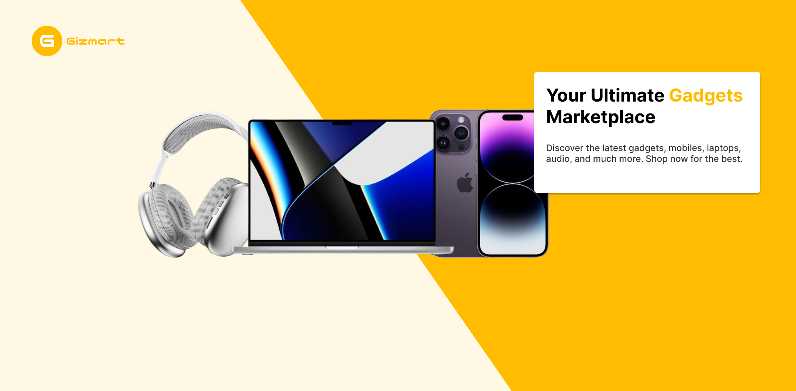

# Gizmart

## Description

**Gizmart** is a dynamic marketplace for mobile gadgets and accessories. It offers a seamless shopping experience with features such as real-time chat, instant notifications, and a robust voucher system to enhance user engagement and satisfaction.

## Features

- **Marketplace**: Browse and purchase a wide range of mobile gadgets and accessories.
- **Chat**: Real-time communication between buyers and sellers.
- **Notifications**: Instant updates on orders, offers, and more.
- **Voucher System**: Apply vouchers for discounts on products.

## Technologies Used

- **Frontend**:
  - **React**: For building the user interface.
  - **Tailwind CSS**: For styling the components.
  - **Next.js**: For server-side rendering and static site generation.
- **Backend**:
  - **Node.js**: For the server-side logic.
  - **Express.js**: As the web application framework.
  - **MongoDB**: As the NoSQL database to store user and product data.
  - **Socket.IO**: For real-time communication (chat and notifications).
- **Payments**:
